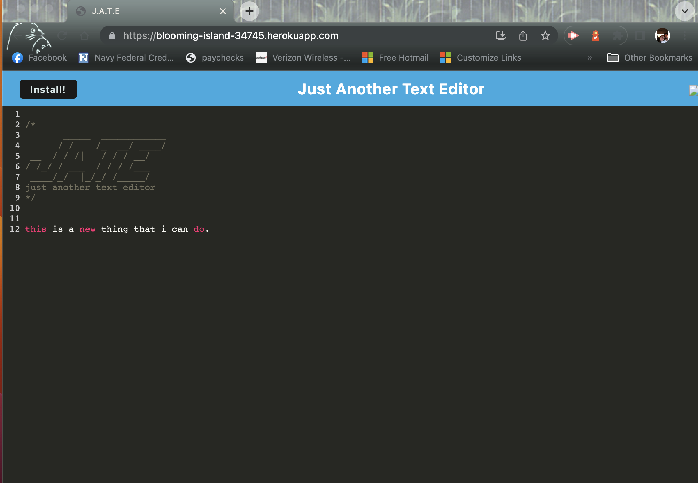

# Text Editor Eh?

## Description
this is an application that will generate a professional readme file for the end user
## Table of Contents
* [Installation](#installation)
* [Usage](#usage)
* [License](#license)
* [Github](#github)
* [Questions](#questions)

## Installation
To install app, run the following:

clone repo to terminal, install `nmp i`, then `npm run build`, `npm run start`. you'll then be able to access the app on your local server.
you can also go to 'https://blooming-island-34745.herokuapp.com/' to see a working copy, hit the little computer icon in the top right hand on the search par and you will install the app onto your machine to be able to use offline.

## Usage
type in things that you would like to be able to use and edit.

## License
MIT

## Tests
How to test:

see install and usage information

## Github 
Repository where this app is stored
https://github.com/afredknot

# Questions
Questions about this repository? Please contact me at afredknot@gmail.com.

